# FortSettler - Дизайн Документация

## 1. Общее описание
FortSettler - это уникальная смесь жанров: стратегии в реальном времени (RTS), tower defense, RPG и генератора историй. Игра вдохновлена такими проектами как RimWorld, Dwarf Fortress, The Settlers и классическими tower defense играми. Игроку предстоит управлять поселением, развивать его от простого лагеря до могучей цитадели, защищать от волн врагов и создавать уникальные истории своих поселенцев.

### 1.1 Основные особенности
#### 1.1.1 Уникальная система развития поселенцев
| Категория | Характеристики | Описание |
|-----------|---------------|----------|
| Физические параметры | - Сила - Ловкость - Выносливость - Здоровье - Скорость - Координация | Базовые физические характеристики, влияющие на производительность и боевые способности |
| Ментальные способности | - Интеллект - Память - Креативность - Логика - Внимание - Аналитические способности | Психические характеристики, определяющие способности к обучению и принятию решений |
| Социальные навыки | - Харизма - Лидерство - Коммуникация - Эмпатия - Дипломатия - Управление конфликтами | Навыки, влияющие на взаимодействие с другими поселенцами |

| Тип навыков | Примеры | Влияние |
|------------|---------|---------|
| Базовые навыки | - Физические упражнения - Боевая подготовка - Ремесло - Выживание - Социальное взаимодействие - Управление ресурсами | Основные умения, необходимые для выживания и развития |
| Специальные таланты | - Уникальные способности - Пассивные бонусы - Комбо-эффекты - Ситуационные преимущества - Специализация - Мастерство | Уникальные способности, дающие особые преимущества |

#### 1.1.2 Динамическая система строительства и развития поселения
| Этап | Тип сооружений | Защита | Инфраструктура |
|------|---------------|--------|----------------|
| Лагерь (1) | - Палатки и навесы - Простые склады - Временные мастерские - Общие зоны отдыха | - Частокол - Простые ловушки - Наблюдательные посты - Сигнальная система | - Дороги и тропы - Водоснабжение - Хранение ресурсов - Зоны добычи |
| Аванпост (2) | - Деревянные дома - Специализированные мастерские - Укрепленные склады - Общественные здания | - Деревянные стены - Оборонительные башни - Ворота с защитой - Рвы и ловушки | - Дороги с покрытием - Система водоснабжения - Канализация - Освещение |
| Форт (3) | - Каменные дома - Специализированные мастерские - Укрепленные склады - Общественные здания | - Каменные стены - Оборонительные башни - Ворота с подъемным мостом - Бойницы и амбразуры | - Мощеные дороги - Система водоснабжения - Канализация - Освещение |
| Цитадель (4) | - Каменные особняки - Специализированные мастерские - Укрепленные склады - Общественные здания | - Укрепленные стены - Оборонительные башни - Ворота с подъемным мостом - Бойницы и амбразуры | - Мощеные дороги - Система водоснабжения - Канализация - Освещение |

## 2. Схемы и связи

### 2.1 Структура развития поселения
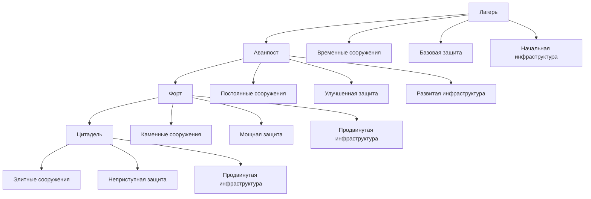

### 2.2 Система характеристик поселенца
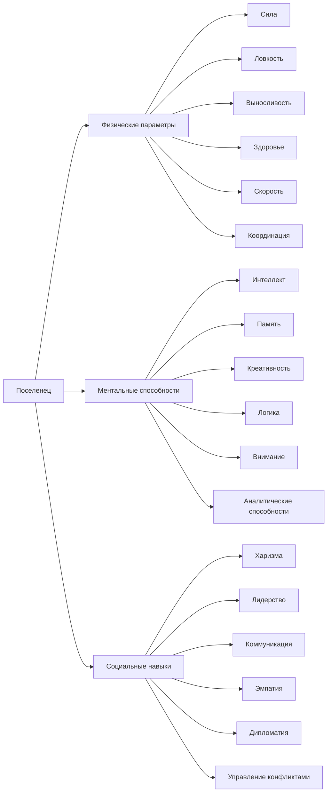

### 2.3 Система навыков и развития
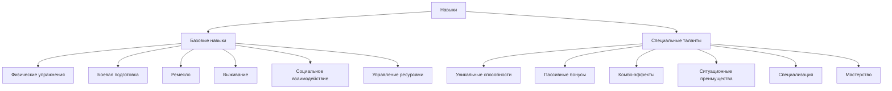

### 2.4 Взаимодействие систем
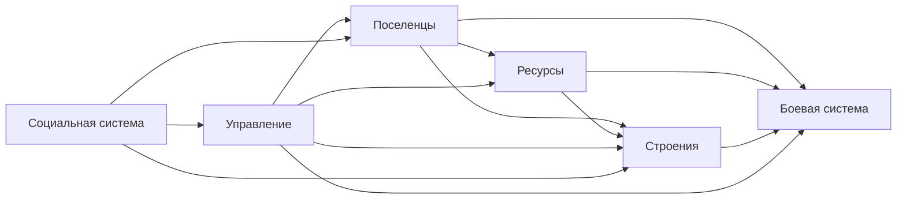

### 2.5 Таблица развития характеристик
| Уровень | Физические параметры | Ментальные способности | Социальные навыки |
|---------|----------------------|------------------------|-------------------|
| 1 (Новичок) | Базовые значения | Базовые значения | Базовые значения |
| 2 (Опытный) | +20% к базовым | +15% к базовым | +10% к базовым |
| 3 (Мастер) | +40% к базовым | +30% к базовым | +20% к базовым |
| 4 (Эксперт) | +60% к базовым | +45% к базовым | +30% к базовым |

### 2.6 Таблица требований к развитию
| Этап | Ресурсы | Время | Рабочая сила | Защита |
|------|---------|-------|--------------|--------|
| Лагерь | Минимальные | 1-2 дня | 5-10 человек | Базовая |
| Аванпост | Средние | 3-5 дней | 10-20 человек | Улучшенная |
| Форт | Высокие | 1-2 недели | 20-40 человек | Мощная |
| Цитадель | Максимальные | 2-4 недели | 40+ человек | Неприступная |

### 2.7 Схема социальных взаимодействий
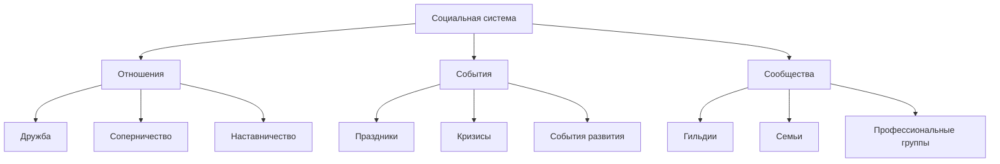

## 3. Игровой процесс

### 3.1 Основные механики
| Механика | Описание | Влияние на геймплей |
|----------|----------|---------------------|
| Управление ресурсами | - Сбор и добыча ресурсов - Распределение ресурсов - Хранение и логистика - Торговля и обмен | Определяет темп развития поселения и эффективность производства |
| Строительство | - Планирование территории - Возведение зданий - Улучшение сооружений - Инфраструктура | Влияет на возможности поселения и его защищенность |
| Развитие поселенцев | - Обучение навыкам - Улучшение характеристик - Специализация - Социальные взаимодействия | Определяет эффективность работы и боевые возможности |
| Защита поселения | - Строительство укреплений - Обучение защитников - Тактическое планирование - Управление боем | Обеспечивает выживание и развитие поселения |

### 3.2 Прогрессия
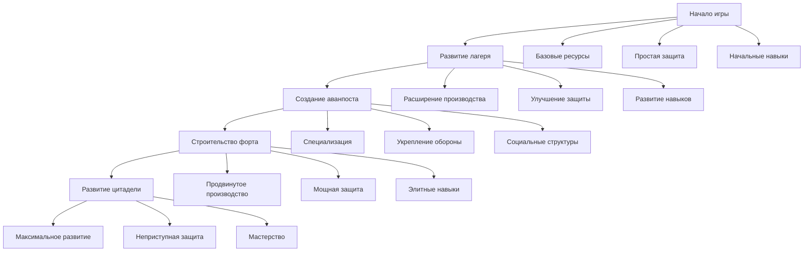

### 3.3 Цикл игры
| Фаза | Действия | Результаты |
|------|----------|------------|
| Утро | - Распределение задач - Проверка ресурсов - Планирование работ - Обучение поселенцев | Подготовка к дневной активности |
| День | - Сбор ресурсов - Строительство - Производство - Обучение | Основная продуктивная деятельность |
| Вечер | - Подведение итогов - Распределение ресурсов - Планирование на завтра - Отдых поселенцев | Подготовка к следующему дню |
| Ночь | - Охрана поселения - Ночные работы - Отдых - События | Поддержание безопасности и подготовка к новому дню |

### 3.4 Система достижений
| Категория | Примеры | Награды |
|-----------|---------|---------|
| Развитие | - Постройка первого здания - Достижение нового уровня - Создание специализации - Улучшение инфраструктуры | Ресурсы, опыт, уникальные предметы |
| Боевые | - Успешная защита - Уничтожение врагов - Тактические победы - Героические поступки | Оружие, броня, боевые навыки |
| Социальные | - Создание семьи - Обучение ученика - Разрешение конфликта - Организация праздника | Социальные бонусы, репутация |
| Экономические | - Успешная торговля - Эффективное производство - Оптимизация ресурсов - Развитие экономики | Экономические бонусы, торговые преимущества |

### 3.5 События и вызовы
| Тип события | Частота | Влияние | Награды |
|------------|---------|---------|---------|
| Случайные события | Ежедневно | Варьируется | Ресурсы, опыт, предметы |
| Сезонные события | Раз в сезон | Значительное | Уникальные ресурсы, навыки |
| Кризисные ситуации | Редко | Критическое | Большие награды, достижения |
| Социальные события | Регулярно | Социальное | Репутация, отношения |
| Экономические события | Периодически | Экономическое | Торговые преимущества |

### 3.6 Система обучения
| Уровень | Содержание | Длительность | Результаты |
|---------|------------|--------------|------------|
| Начальный | - Базовые механики - Управление ресурсами - Простое строительство - Основы защиты | 1-2 игровых дня | Понимание основных механик |
| Продвинутый | - Специализация - Тактическое планирование - Экономика - Социальные взаимодействия | 3-5 игровых дней | Умение эффективно развивать поселение |
| Экспертный | - Продвинутые стратегии - Оптимизация процессов - Сложные тактики - Управление кризисами | 1-2 игровые недели | Мастерство в управлении поселением |

## 4. Механики

### 4.1 Механика ресурсов
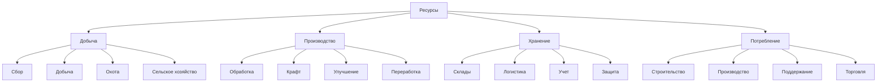

| Тип ресурса | Добыча | Обработка | Использование | Особенности |
|------------|--------|-----------|---------------|-------------|
| Древесина | - Сбор: 10 ед./час - +5% за уровень навыка - +10% за инструменты - Сезонные модификаторы | - Распил: 1:2 - Обработка: +20% качества - Сушка: +30% прочности - Пропитка: +50% долговечности | - Строительство: 5-20 ед. - Топливо: 1-5 ед./день - Крафт: 2-10 ед. - Укрепления: 10-30 ед. | - Возобновляемый - Сезонные колебания - Качество зависит от дерева - Требует хранения |
| Камень | - Добыча: 5 ед./час - +3% за уровень - +8% за инструменты - Геологические особенности | - Обработка: 1:1.5 - Шлифовка: +25% качества - Резка: +40% точности - Полировка: +60% красоты | - Строительство: 10-40 ед. - Укрепления: 20-60 ед. - Декор: 5-15 ед. - Инструменты: 3-12 ед. | - Ограниченные месторождения - Требует специальных инструментов - Разные типы камня - Долговечный |
| Металл | - Добыча: 3 ед./час - +2% за уровень - +5% за инструменты - Геологические особенности | - Плавка: 1:0.8 - Ковка: +30% прочности - Закалка: +50% качества - Легирование: +70% свойств | - Оружие: 8-25 ед. - Броня: 5-20 ед. - Инструменты: 3-15 ед. - Укрепления: 10-30 ед. | - Редкий ресурс - Сложная обработка - Высокая ценность - Требует топлива |
| Еда | - Сбор: 15 ед./час - +7% за уровень - +12% за инструменты - Сезонные модификаторы | - Приготовление: 1:1.2 - Консервация: +50% срока - Улучшение: +30% качества - Специи: +20% эффектов | - Питание: 2 ед./чел. - Животные: 5 ед./день - Праздники: 10-30 ед. - Торговля: 5-20 ед. | - Скоропортящийся - Требует хранения - Сезонные колебания - Разные типы пищи |

### 4.2 Механика строительства
| Этап | Процесс | Требования | Результат | Оптимизация |
|------|---------|------------|-----------|-------------|
| Планирование | - Выбор места - Разметка территории - Расчет ресурсов - Распределение рабочих - Учет особенностей | - Свободное пространство - Достаточно ресурсов - Квалифицированные рабочие - Инструменты - Время | - План строительства - Смета ресурсов - График работ - Распределение задач | - Оптимизация маршрутов - Минимизация затрат - Учет будущего развития - Адаптация к местности |
| Подготовка | - Расчистка территории - Подготовка фундамента - Доставка материалов - Организация работ - Подготовка инструментов | - Инструменты - Рабочая сила - Материалы - Время - Технические знания | - Готовность к строительству - Организованная площадка - Доступные материалы - Настроенные инструменты | - Параллельные работы - Оптимизация логистики - Предварительная подготовка - Минимизация простоев |
| Строительство | - Возведение конструкции - Прокладка коммуникаций - Отделочные работы - Проверка качества - Устранение дефектов | - Строительные материалы - Квалифицированные рабочие - Инструменты - Контроль - Время | - Готовое здание - Функциональные системы - Качественная отделка - Проверенная конструкция | - Конвейерное строительство - Специализация рабочих - Оптимизация процессов - Контроль качества |
| Ввод в эксплуатацию | - Проверка систем - Обучение персонала - Настройка процессов - Запуск производства - Тестирование функций | - Энергия - Персонал - Ресурсы - Время - Знания | - Функционирующее здание - Обученный персонал - Настроенные процессы - Рабочее производство | - Автоматизация процессов - Оптимизация работы - Минимизация затрат - Максимизация эффективности |

### 4.3 Механика развития поселенцев
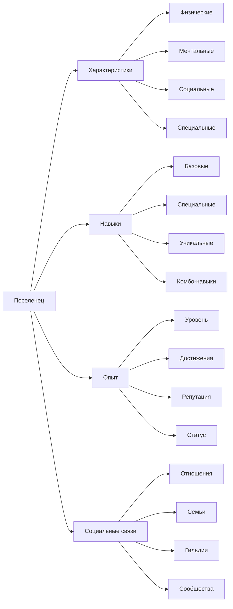

| Аспект развития | Механики | Эффекты | Ограничения | Оптимизация |
|----------------|----------|---------|-------------|-------------|
| Физическая подготовка | - Тренировки: +0.5%/день - Работа: +0.2%/день - Отдых: восстановление - Питание: +0.3%/день - События: +1-5% | - Сила: +1-20% - Выносливость: +1-15% - Здоровье: +1-25% - Скорость: +1-10% | - Усталость: -0.1%/час - Травмы: -5-20% - Возраст: -0.1%/год - Болезни: -10-30% | - Специализация - Оптимальные нагрузки - Правильное питание - Регулярный отдых |
| Ментальное развитие | - Обучение: +0.4%/день - Практика: +0.1%/день - Исследования: +0.3%/день - Отдых: восстановление - События: +1-4% | - Интеллект: +1-15% - Память: +1-20% - Креативность: +1-25% - Логика: +1-15% | - Усталость: -0.2%/час - Стресс: -5-15% - Возраст: -0.2%/год - Психические травмы: -10-25% | - Специализация - Регулярная практика - Правильный отдых - Управление нагрузкой |
| Социальные навыки | - Взаимодействие: +0.3%/день - Лидерство: +0.2%/день - Обучение других: +0.4%/день - События: +1-3% | - Харизма: +1-20% - Лидерство: +1-15% - Дипломатия: +1-25% - Эмпатия: +1-20% | - Конфликты: -5-10% - Изоляция: -0.1%/день - Возраст: -0.1%/год - Травмы: -10-20% | - Регулярное общение - Участие в событиях - Разрешение конфликтов - Поддержание отношений |
| Специальные способности | - Тренировка: +0.2%/день - Практика: +0.3%/день - События: +1-5% - Наставничество: +0.4%/день | - Уникальные навыки: +1-30% - Комбо-эффекты: +5-15% - Пассивные бонусы: +1-10% - Активные способности: +10-25% | - Сложность освоения - Ограниченное количество - Требования к характеристикам - Время на развитие | - Специализация - Регулярная практика - Правильное обучение - Оптимальные комбинации |

### 4.4 Механика защиты
| Элемент | Тип | Эффективность | Требования | Развитие |
|---------|-----|---------------|------------|----------|
| Стены | - Деревянные: 50 защиты - Каменные: 100 защиты - Укрепленные: 150 защиты - Магические: 200 защиты | - Базовая защита - +10 за уровень - +5 за материал - +15 за улучшения - +20 за магию | - Ресурсы: 30-100 ед. - Рабочая сила: 2-5 чел. - Время: 2-8 часов - Навыки: 1-4 уровня | - Улучшение материалов - Добавление функций - Комбинирование типов - Магические улучшения |
| Башни | - Наблюдательные: +50% обзор - Стрелковые: +25% атака - Магические: +30% защита - Командные: +20% все | - Обзор: 50-200% - Атака: 25-100% - Защита: 15-60% - Поддержка: 10-40% | - Ресурсы: 40-120 ед. - Рабочая сила: 3-6 чел. - Время: 3-10 часов - Навыки: 2-5 уровня | - Улучшение функций - Специализация - Комбинирование типов - Магические улучшения |
| Ловушки | - Механические: 20 урона - Магические: 30 урона - Комбинированные: 40 урона - Специальные: 50 урона | - Урон: 20-100 - Замедление: 30-90% - Площадь: 5x5-10x10 - Эффекты: 1-3 | - Ресурсы: 15-60 ед. - Установка: 1-3 чел. - Время: 1-4 часа - Навыки: 1-3 уровня | - Улучшение эффективности - Добавление эффектов - Комбинирование типов - Автоматизация |
| Гарнизон | - Обычные: +20% защита - Элитные: +40% защита - Специальные: +60% защита - Магические: +80% защита | - Защита: 20-100% - Атака: 15-75% - Мораль: 10-50% - Поддержка: 5-25% | - Еда: 10-30/день - Оружие: 1-3/боец - Броня: 1-2/боец - Обучение: 1-5 уровня | - Улучшение снаряжения - Специализация - Тактическая подготовка - Магические улучшения |

### 4.5 Механика событий
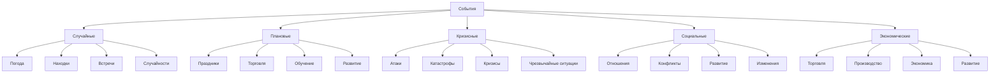

| Тип события | Триггеры | Последствия | Реакция | Управление |
|------------|---------|-------------|---------|------------|
| Погодные явления | - Случайно: 1-3 раза/день - Сезонно: +50% частота - По условиям: +25% шанс - Катастрофы: 1% шанс | - Производство: ±10-30% - Комфорт: ±20-40% - Защита: ±30-50% - Ресурсы: ±15-35% | - Подготовка: -20% урон - Адаптация: +15% эффективность - Защита: +25% стойкость - Восстановление: +20% скорость | - Прогнозирование - Планирование - Адаптация - Восстановление |
| Социальные события | - По расписанию: 1-2/неделю - По достижениям: +25% шанс - По запросу: 100% шанс - Случайно: 5% шанс | - Мораль: ±15-30% - Продуктивность: ±10-20% - Развитие: ±5-15% - Отношения: ±10-25% | - Организация: +20% эффект - Управление: +15% контроль - Участие: +10% влияние - Поддержка: +25% стабильность | - Планирование - Организация - Контроль - Анализ |
| Кризисные ситуации | - Случайно: 1-2/месяц - По прогрессу: +10% шанс - По условиям: +15% шанс - По запросу: 100% шанс | - Ресурсы: ±25-50% - Защита: ±20-40% - Население: ±15-30% - Развитие: ±20-35% | - Мобилизация: +30% эффективность - Адаптация: +25% скорость - Защита: +35% стойкость - Восстановление: +40% скорость | - Подготовка - Реагирование - Восстановление - Анализ |
| Экономические события | - Еженедельно: 1-2 раза - По развитию: +20% шанс - По торговле: +15% шанс - Случайно: 10% шанс | - Экономика: ±20-40% - Производство: ±15-30% - Торговля: ±10-25% - Развитие: ±5-20% | - Планирование: +25% эффективность - Адаптация: +20% скорость - Оптимизация: +30% результат - Развитие: +35% прогресс | - Анализ - Планирование - Оптимизация - Развитие |

### 4.6 Механика боевой системы
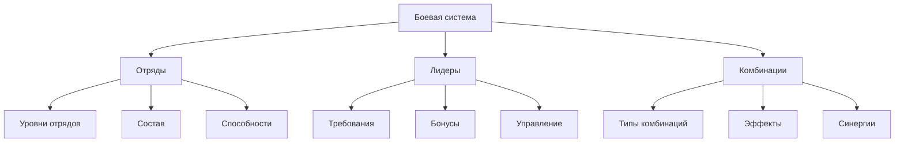

| Аспект | Механика | Эффекты | Развитие |
|--------|----------|---------|----------|
| Отряды | - Уровень 1: 5 человек - Уровень 2: 10 человек - Уровень 3: 15 человек - Зависит от уровня лидера | - Базовые характеристики - Групповые бонусы - Специальные способности - Синергии | - Улучшение через опыт - Обучение новых членов - Специализация - Комбинирование классов |
| Лидеры | - Требования: 5+ уровень - Класс: Воин/Командир - Характеристики: Лидерство 15+ - Опыт: 100+ боев | - +10% к характеристикам отряда - +15% к морали - +20% к эффективности - Специальные команды | - Улучшение лидерских качеств - Развитие тактических навыков - Получение новых команд - Улучшение бонусов |
| Комбинации | - 5 лучников: Залп стрел - 3 воина + 2 лекаря: Защитный строй - 4 разведчика + 1 снайпер: Точечные удары - 2 танка + 3 мага: Магический щит | - Групповые способности - Синергетические бонусы - Комбо-эффекты - Специальные атаки | - Улучшение комбинаций - Новые варианты построения - Улучшение эффектов - Специализация отрядов |

#### 4.6.1 Механика отрядов
| Уровень | Размер | Требования | Бонусы |
|---------|--------|------------|--------|
| 1 | 5 человек | - Базовый уровень лидера - Минимальный опыт - Базовое снаряжение | - +5% к атаке - +5% к защите - Базовая тактика - Простые команды |
| 2 | 10 человек | - Лидер 10+ уровень - Средний опыт - Улучшенное снаряжение | - +10% к атаке - +10% к защите - Продвинутая тактика - Специальные команды |
| 3 | 15 человек | - Лидер 15+ уровень - Высокий опыт - Элитное снаряжение | - +15% к атаке - +15% к защите - Элитная тактика - Уникальные команды |

#### 4.6.2 Механика лидеров
| Уровень | Требования | Бонусы | Способности |
|---------|------------|--------|-------------|
| 5 | - Класс Воин/Командир - Лидерство 15+ - 100+ боев - Базовые навыки | - +10% к отряду - +15% к морали - Простые команды - Базовая тактика | - Формирование отряда - Базовые приказы - Простая тактика - Мотивация |
| 10 | - Лидерство 25+ - 300+ боев - Продвинутые навыки | - +15% к отряду - +20% к морали - Специальные команды - Продвинутая тактика | - Специальные приказы - Тактические маневры - Улучшенная мотивация - Стратегическое планирование |
| 15 | - Лидерство 35+ - 500+ боев - Элитные навыки | - +20% к отряду - +25% к морали - Уникальные команды - Элитная тактика | - Уникальные приказы - Сложные маневры - Элитная мотивация - Стратегическое превосходство |

#### 4.6.3 Механика комбинаций
| Тип | Состав | Способности | Эффекты |
|-----|--------|-------------|---------|
| Залп стрел | 5 лучников | - Массовый обстрел - Точечный огонь - Прицельная стрельба - Огненные стрелы | - +50% урона по площади - +30% точности - +20% пробития - Огненный урон |
| Защитный строй | 3 воина + 2 лекаря | - Щитовой строй - Исцеление - Защита - Контратака | - +40% защиты - +30% исцеления - +20% контратаки - Устойчивость к урону |
| Точечные удары | 4 разведчика + 1 снайпер | - Разведка - Точечные удары - Маскировка - Диверсии | - +60% к скрытности - +40% к критическому урону - +30% к разведке - Внезапные атаки |
| Магический щит | 2 танка + 3 мага | - Магическая защита - Элементальные атаки - Усиление - Контроль | - +50% магической защиты - +35% к магическому урону - +25% к контролю - Элементальные эффекты |

## 5. Системы

### 5.1 Система управления ресурсами
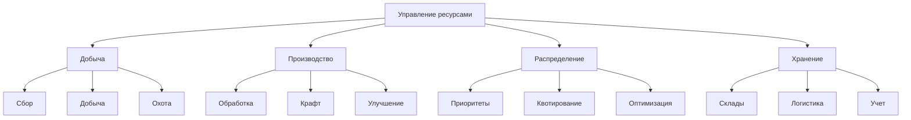

| Подсистема | Функции | Взаимодействие | Оптимизация |
|------------|---------|----------------|-------------|
| Добыча | - Сбор ресурсов - Добыча полезных ископаемых - Охота и рыбалка - Сельское хозяйство | Строительство, производство, защита | - Автоматизация - Специализация - Улучшение инструментов |
| Производство | - Обработка сырья - Крафт предметов - Улучшение ресурсов - Создание инструментов | Экономика, строительство, защита | - Конвейерное производство - Специализация - Улучшение технологий |
| Распределение | - Приоритизация задач - Квотирование ресурсов - Оптимизация потоков - Управление запасами | Все системы игры | - Автоматическое распределение - Адаптивные алгоритмы - Прогнозирование потребностей |
| Хранение | - Организация складов - Логистика - Учет ресурсов - Защита запасов | Экономика, защита, производство | - Оптимизация пространства - Автоматизация учета - Защита от потерь |

### 5.2 Система строительства
| Компонент | Функции | Требования | Взаимодействие |
|-----------|---------|------------|----------------|
| Планирование | - Выбор места - Разметка территории - Расчет ресурсов - Распределение рабочих | - Свободное пространство - Достаточно ресурсов - Квалифицированные рабочие | Управление ресурсами, защита |
| Строительство | - Возведение конструкций - Прокладка коммуникаций - Отделочные работы - Проверка качества | - Материалы - Рабочая сила - Инструменты - Время | Производство, защита, экономика |
| Эксплуатация | - Обслуживание - Ремонт - Модернизация - Управление | - Энергия - Персонал - Ресурсы - Техническое обслуживание | Все системы игры |
| Развитие | - Расширение - Улучшение - Специализация - Оптимизация | - Ресурсы - Технологии - Квалификация - Время | Экономика, защита, производство |

### 5.3 Система развития поселенцев
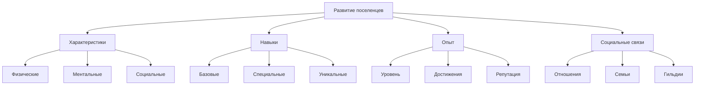

| Аспект | Механики | Развитие | Влияние |
|--------|----------|----------|---------|
| Характеристики | - Тренировки - Обучение - Практика - Отдых | - Постепенное улучшение - Специализация - Баланс развития | - Производительность - Боевые способности - Социальные навыки |
| Навыки | - Обучение - Практика - Наставничество - События | - Приобретение новых - Улучшение существующих - Комбинации навыков | - Эффективность работы - Тактические возможности - Социальное влияние |
| Опыт | - Выполнение задач - Участие в событиях - Обучение других - Достижения | - Повышение уровня - Открытие возможностей - Улучшение характеристик | - Доступ к новым механикам - Улучшение эффективности - Социальный статус |
| Социальные связи | - Взаимодействие - События - Совместная деятельность - Конфликты | - Развитие отношений - Создание семей - Формирование групп - Управление конфликтами | - Эффективность работы - Мораль поселения - Стабильность общества |

### 5.4 Система защиты
| Элемент | Функции | Развитие | Интеграция |
|---------|---------|----------|------------|
| Укрепления | - Защита территории - Контроль доступа - Тактические преимущества - Замедление врага | - Улучшение материалов - Расширение площади - Добавление функций - Комбинирование типов | Строительство, ресурсы, тактика |
| Гарнизон | - Охрана территории - Отражение атак - Разведка - Поддержка | - Обучение бойцов - Улучшение снаряжения - Тактическая подготовка - Специализация | Развитие поселенцев, ресурсы |
| Ловушки | - Нанесение урона - Замедление врага - Контроль территории - Тактические преимущества | - Улучшение эффективности - Добавление типов - Комбинирование эффектов - Автоматизация | Ресурсы, строительство, тактика |
| Тактика | - Планирование обороны - Управление боем - Адаптация к угрозам - Использование преимуществ | - Развитие стратегий - Улучшение координации - Специализация - Инновации | Все системы защиты |

### 5.5 Система событий
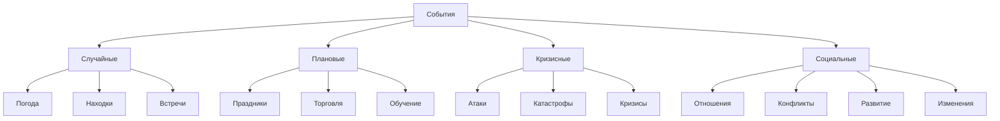

| Тип | Триггеры | Влияние | Управление |
|-----|----------|---------|------------|
| Случайные | - Время - Действия игрока - Состояние мира - Вероятности | - Изменение ресурсов - Влияние на поселенцев - Новые возможности - Угрозы | - Подготовка - Адаптация - Использование возможностей - Минимизация рисков |
| Плановые | - Календарь - Условия - Достижения - Развитие | - Развитие поселения - Улучшение отношений - Экономические эффекты - Социальные изменения | - Планирование - Организация - Распределение ресурсов - Контроль результатов |
| Кризисные | - Угрозы - Накопленные проблемы - Внешние факторы - Внутренние конфликты | - Серьезные изменения - Потери ресурсов - Изменение баланса - Новые вызовы | - Мобилизация - Адаптация - Управление кризисом - Восстановление |
| Социальные | - Взаимодействия - Настроение - Развитие отношений - Внешние факторы | - Изменение отношений - Развитие сообщества - Экономические эффекты - Политические изменения | - Дипломатия - Управление конфликтами - Развитие сообщества - Поддержание баланса |

## 6. Баланс

### 6.1 Баланс ресурсов
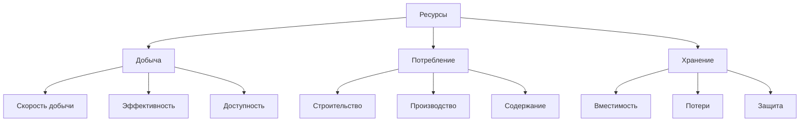

| Ресурс | Добыча | Потребление | Баланс |
|--------|--------|-------------|--------|
| Древесина | - 10 ед./час (базовое) - +5% за уровень навыка - +10% за улучшенные инструменты | - 5 ед./здание - 2 ед./оружие - 1 ед./инструмент | - Запас на 2-3 дня - Возобновляемый ресурс - Сезонные колебания |
| Камень | - 5 ед./час (базовое) - +3% за уровень навыка - +8% за улучшенные инструменты | - 10 ед./укрепление - 5 ед./здание - 3 ед./оружие | - Запас на 3-4 дня - Ограниченные месторождения - Требует специальных инструментов |
| Металл | - 3 ед./час (базовое) - +2% за уровень навыка - +5% за улучшенные инструменты | - 8 ед./оружие - 5 ед./броня - 3 ед./инструмент | - Запас на 4-5 дней - Редкий ресурс - Высокая ценность |
| Еда | - 15 ед./час (базовое) - +7% за уровень навыка - +12% за улучшенные инструменты | - 2 ед./поселенец/день - 5 ед./животное/день - 10 ед./праздник | - Запас на 5-7 дней - Сезонные колебания - Требует хранения |

### 6.2 Баланс строительства
| Тип здания | Ресурсы | Время | Рабочая сила | Эффективность |
|------------|---------|-------|--------------|---------------|
| Жилье | - Древесина: 20 - Камень: 10 - Ткань: 5 | 2 часа | 2 рабочих | +5 комфорта +2 жителя |
| Мастерская | - Древесина: 30 - Камень: 20 - Металл: 5 | 3 часа | 3 рабочих | +15% к производству +10% к качеству |
| Склад | - Древесина: 25 - Камень: 15 | 2.5 часа | 2 рабочих | +100 единиц хранения -10% к потерям |
| Укрепления | - Камень: 40 - Металл: 10 - Древесина: 20 | 4 часа | 4 рабочих | +50% к защите +25% к обзору |

### 6.3 Баланс развития поселенцев
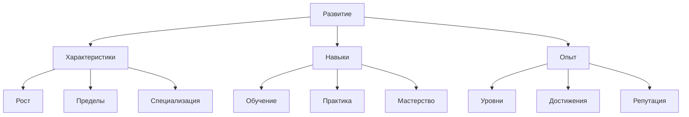

| Аспект | Скорость роста | Пределы | Специализация |
|--------|---------------|---------|---------------|
| Физические | - +1% в день (базовое) - +0.5% за тренировку - +0.2% за работу | Максимум +100% | - Сила: +20% - Ловкость: +15% - Выносливость: +25% |
| Ментальные | - +0.8% в день (базовое) - +0.4% за обучение - +0.1% за практику | Максимум +80% | - Интеллект: +20% - Память: +15% - Креативность: +25% |
| Социальные | - +0.6% в день (базовое) - +0.3% за взаимодействие - +0.1% за события | Максимум +60% | - Харизма: +20% - Лидерство: +15% - Дипломатия: +25% |

### 6.4 Баланс защиты
| Элемент | Эффективность | Стоимость | Обслуживание |
|---------|--------------|-----------|--------------|
| Стены | - Базовая защита: 50 - +10 за уровень - +5 за материал | - Древесина: 30 - Камень: 40 - Металл: 20 | - 5 ресурсов/день - 1 рабочий/секция |
| Башни | - Обзор: 100% - Атака: +25% - Защита: +15% | - Древесина: 40 - Камень: 50 - Металл: 30 | - 8 ресурсов/день - 2 рабочих/башня |
| Ловушки | - Урон: 20 - Замедление: 30% - Площадь: 5x5 | - Древесина: 15 - Металл: 10 - Камень: 5 | - 3 ресурса/день - 1 рабочий/5 ловушек |
| Гарнизон | - Защита: +40% - Атака: +30% - Мораль: +20% | - Еда: 10/день - Оружие: 1/боец - Броня: 1/боец | - 15 ресурсов/день - 1 командир/10 бойцов |

### 6.5 Баланс событий
| Тип события | Частота | Влияние | Награды |
|------------|---------|---------|---------|
| Погодные | - Каждый день - Сезонные изменения - Редкие катастрофы | - ±10% к производству - ±20% к комфорту - ±30% к защите | - Опыт выживания - Уникальные ресурсы - Улучшения |
| Социальные | - Еженедельно - По достижениям - По запросу | - ±15% к морали - ±10% к продуктивности - ±5% к развитию | - Социальные бонусы - Улучшения отношений - Репутация |
| Кризисные | - Раз в 2 недели - По прогрессу - Случайные | - ±25% к ресурсам - ±20% к защите - ±15% к населению | - Большие награды - Уникальные предметы - Достижения |
| Экономические | - Еженедельно - По развитию - По торговле | - ±20% к экономике - ±15% к производству - ±10% к торговле | - Экономические бонусы - Торговые преимущества - Ресурсы |

## 7. Планы развития

### 7.1 Этапы разработки
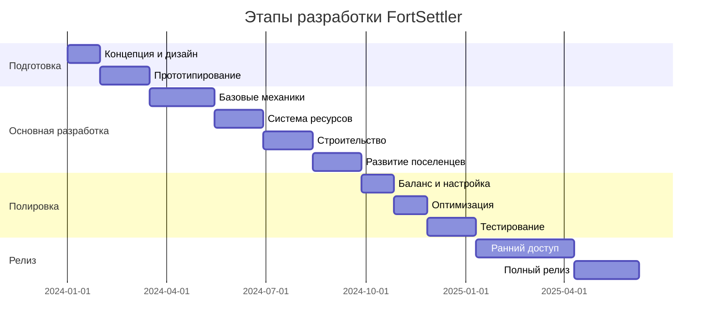

### 7.2 Приоритеты разработки
| Приоритет | Функция | Описание | Сроки |
|-----------|---------|----------|-------|
| Высокий | - Базовые механики - Система ресурсов - Строительство - Защита | Основной геймплей и функционал | 3-6 месяцев |
| Средний | - Развитие поселенцев - Социальные системы - Экономика - События | Углубление механик и контента | 6-9 месяцев |
| Низкий | - Мультиплеер - Модификации - Дополнительный контент - Оптимизация | Расширение возможностей | 9-12 месяцев |

### 7.3 Планы по контенту
| Тип контента | Этап 1 | Этап 2 | Этап 3 |
|--------------|--------|--------|--------|
| Здания | - Базовые жилища - Простые мастерские - Склады - Укрепления | - Специализированные здания - Улучшенные мастерские - Общественные здания - Продвинутые укрепления | - Уникальные здания - Элитные мастерские - Декоративные элементы - Магические сооружения |
| Ресурсы | - Древесина - Камень - Металл - Еда | - Редкие металлы - Магические материалы - Специальные ресурсы - Улучшенные материалы | - Уникальные ресурсы - Легендарные материалы - Магические кристаллы - Артефакты |
| Поселенцы | - Базовые классы - Простые навыки - Основные характеристики | - Специализации - Продвинутые навыки - Уникальные способности | - Легендарные классы - Магические способности - Эпические таланты |
| События | - Погодные явления - Простые кризисы - Базовые праздники | - Сложные кризисы - Уникальные события - Специальные праздники | - Эпические события - Легендарные кризисы - Глобальные изменения |

### 7.4 Планы по балансу
| Аспект | Текущий этап | Планируемые изменения | Цели |
|--------|-------------|----------------------|------|
| Ресурсы | - Базовая экономика - Простое производство - Линейное развитие | - Сложная экономика - Цепочки производства - Нелинейное развитие | - Сбалансированная экономика - Интересные механики - Глубокий геймплей |
| Строительство | - Простые здания - Базовые улучшения - Линейный прогресс | - Сложные здания - Множественные улучшения - Ветвящийся прогресс | - Гибкая система - Множество вариантов - Стратегическая глубина |
| Боевая система | - Простая защита - Базовые атаки - Линейные улучшения | - Сложная защита - Тактические атаки - Ветвящиеся улучшения | - Тактическая глубина - Множество стратегий - Сбалансированные бои |
| Развитие | - Линейный прогресс - Простые навыки - Базовые характеристики | - Нелинейный прогресс - Сложные навыки - Уникальные характеристики | - Глубокое развитие - Множество путей - Интересные комбинации |

### 7.5 Планы по сообществу
| Направление | Краткосрочные | Среднесрочные | Долгосрочные |
|------------|--------------|---------------|--------------|
| Сообщество | - Форум - Discord - Базовые соцсети - Система отчетов | - Гильдии - Турниры - Соревнования - Система достижений | - Киберспорт - Крупные турниры - Глобальные события - Профессиональная лига |
| Контент | - Гайды - Вики - Базовые моды - Скриншоты | - Видео-гайды - Продвинутые моды - Стримы - Фан-арт | - Профессиональные моды - Кинематографический контент - Книги по лору - Мерч |
| Поддержка | - Базовые патчи - Исправление багов - Простые обновления | - Крупные обновления - Новый контент - Баланс-патчи | - Расширения - Кроссоверы - Специальные издания - Коллекционные издания |

## 8. Социальные функции

### 8.1 Система социальных взаимодействий
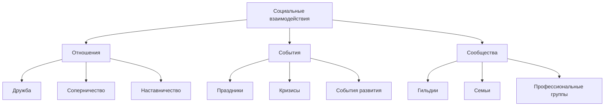

| Тип взаимодействия | Механики | Влияние | Развитие |
|-------------------|----------|---------|----------|
| Дружба | - Совместная деятельность - Обмен подарками - Помощь в кризисах - Поддержка | - +20% к эффективности - +15% к морали - +10% к развитию - Специальные бонусы | - Уровни дружбы - Уникальные взаимодействия - Совместные способности - Семейные связи |
| Соперничество | - Соревнования - Конкуренция за ресурсы - Профессиональные дуэли - Лидерские позиции | - +15% к мотивации - +10% к развитию - -5% к морали - Стимул к улучшению | - Уровни соперничества - Специальные вызовы - Уникальные награды - Профессиональный рост |
| Наставничество | - Обучение навыкам - Передача опыта - Совместные проекты - Поддержка развития | - +25% к скорости обучения - +20% к качеству навыков - +15% к репутации - Наследование способностей | - Уровни наставничества - Специальные умения - Уникальные методы - Школы мастерства |

### 8.2 Система сообществ
| Тип сообщества | Структура | Функции | Развитие |
|---------------|-----------|---------|----------|
| Гильдии | - Мастер - Старшие члены - Обычные члены - Ученики | - Совместные проекты - Обмен ресурсами - Обучение - Защита | - Уровни гильдии - Специальные здания - Уникальные навыки - Гильдейские бонусы |
| Семьи | - Глава семьи - Взрослые члены - Дети - Родственники | - Совместное проживание - Наследование - Поддержка - Развитие | - Генеалогическое древо - Семейные традиции - Наследственные черты - Семейные бонусы |
| Профессиональные группы | - Лидер - Специалисты - Подмастерья - Ученики | - Совместная работа - Обмен опытом - Обучение - Развитие профессии | - Уровни профессии - Специальные умения - Профессиональные бонусы - Уникальные методы |

### 8.3 Система событий
| Тип события | Частота | Участники | Награды |
|------------|---------|-----------|---------|
| Праздники | - Еженедельно - По сезонам - По достижениям - По запросу | - Все поселенцы - Специальные гости - Приглашенные - Гости | - Повышение морали - Уникальные предметы - Специальные бонусы - Улучшение отношений |
| Кризисы | - Случайно - По прогрессу - По условиям - По запросу | - Затронутые поселенцы - Специальные группы - Весь поселок - Внешние силы | - Опыт выживания - Уникальные ресурсы - Специальные навыки - Улучшение характеристик |
| События развития | - По достижениям - По прогрессу - По запросу - Случайно | - Отдельные поселенцы - Группы - Весь поселок - Внешние силы | - Улучшение навыков - Новые возможности - Специальные бонусы - Уникальные предметы |

### 8.4 Система репутации
| Аспект | Влияние | Развитие | Бонусы |
|--------|---------|----------|--------|
| Личная | - Отношения с другими - Карьерный рост - Социальный статус - Возможности | - Действия и поступки - Достижения - Помощь другим - Лидерство | - Улучшенные отношения - Специальные возможности - Уникальные взаимодействия - Бонусы к навыкам |
| Профессиональная | - Карьера - Доход - Статус - Возможности | - Профессиональные достижения - Обучение других - Инновации - Мастерство | - Повышенный доход - Специальные заказы - Уникальные методы - Профессиональные бонусы |
| Социальная | - Положение в обществе - Влияние - Авторитет - Возможности | - Общественная деятельность - Помощь сообществу - Лидерство - Достижения | - Социальные бонусы - Уникальные возможности - Специальные привилегии - Улучшенные отношения |

### 8.5 Система мультиплеера
| Режим | Особенности | Взаимодействие | Развитие |
|-------|-------------|----------------|----------|
| Кооперативный | - Совместное строительство - Общие ресурсы - Взаимопомощь - Совместные события | - Чат - Торговля - Обмен ресурсами - Совместные проекты | - Общий прогресс - Совместные достижения - Уникальные взаимодействия - Специальные бонусы |
| Соревновательный | - Соревнования - Конкуренция - Турниры - Рейтинги | - Дуэли - Соревнования - Торговля - Дипломатия | - Личные достижения - Рейтинг - Уникальные награды - Специальные титулы |
| Смешанный | - Гибкие правила - Адаптивные механики - Динамические события - Гибридные режимы | - Гибкие взаимодействия - Адаптивная торговля - Динамические союзы - Гибридные проекты | - Гибкий прогресс - Адаптивные достижения - Уникальные комбинации - Специальные возможности |